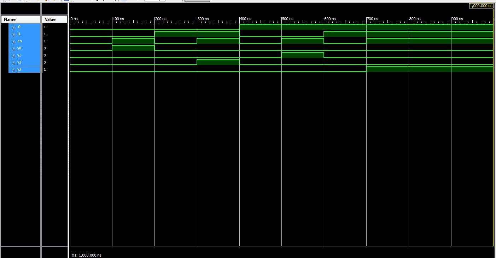
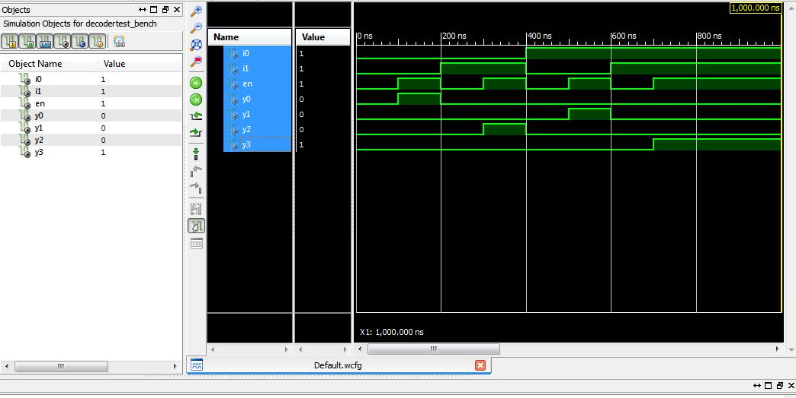

ECE281_CE2
==========
# C3C Sung Woo Suh

# screenshot of behavioral

# screenshot of structural

#VHD file for decoder_behavioral
https://github.com/suhsungwoo/CE2/blob/master/Decoder_behavioral.vhd

#VHD file for decoder_behavioral
https://github.com/suhsungwoo/CE2/blob/master/Decoder_Structural.vhd

#number 15
What we created was basically a schematics into a programmed structural design. The decoder is a stand-alone player according to HowStuffWorks. In a use for computer, it can decode message inputs and make an output out of it. 
